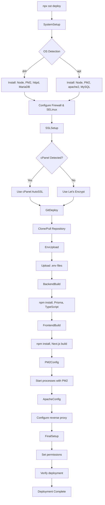

# Full-Stack Application - Automated Deployment with SST

**Infrastructure as Code** solution for deploying full-stack Node.js applications (Next.js frontend + Express/Node backend) to Linux servers using SST and Pulumi Command provider.

## Features

- **Cross-Platform**: Auto-detects Ubuntu/Debian (apt) or CentOS/AlmaLinux/Rocky Linux (dnf)
- **Dynamic Configuration**: Application name, ports, and paths configured via `.env`
- **Automated SSL**: cPanel AutoSSL detection with Let's Encrypt fallback
- **Modular Architecture**: Clean, maintainable code structure in `config/` directory
- **Idempotent**: Safe to run multiple times without side effects
- **WebSocket Support**: Proper Apache configuration for Socket.IO
- **Zero-Downtime**: PM2 handles graceful process restarts
- **Security Hardened**: SELinux, firewall, HTTPS-only with strong ciphers

## Quick Start

### 1. Install Dependencies

```bash
npm install
```

### 2. Configure Environment

Copy example files and update with your values:

```bash
cp .env.example .env
cp .env.backend.example .env.backend
cp .env.frontend.example .env.frontend
```

**Required in `.env`:**
```env
APP_NAME=myapp                              # Application identifier
SERVER_IP=your-server.com                    # Server hostname or IP
SSH_USER=root                                # SSH username
SSH_KEY_PATH=/path/to/private/key           # SSH private key path
GIT_REPO_URL=https://github.com/user/repo.git
GIT_TOKEN=github_pat_xxxxx                  # GitHub PAT
DOMAIN=yourdomain.com                        # Production domain
NODE_VERSION=22                              # Node.js version
```

### 3. Deploy

```bash
npx sst deploy
```

That's it! The deployment will:
- Install all required software (Node.js, PM2, Apache, SSL tools)
- Obtain SSL certificate (cPanel or Let's Encrypt)
- Clone your repository
- Build frontend and backend
- Configure PM2 for process management
- Set up Apache reverse proxy with WebSocket support
- Start your application

## Supported Operating Systems

### CentOS Stream / AlmaLinux / Rocky Linux (dnf)

**Automatically configured:**
- **Firewall**: firewalld opens ports 80, 443
- **SELinux**: Configured for Apache proxy connections
- **Apache**: httpd with mod_ssl, mod_proxy, mod_proxy_wstunnel
- **Database**: MariaDB server
- **Service**: `httpd`
- **Config Path**: `/etc/httpd/conf.d/`
- **Logs**: `/var/log/httpd/`

**Verification:**
```bash
# Check firewall
firewall-cmd --list-services  # Should show: http https

# Check SELinux
getsebool httpd_can_network_connect  # Should be: on

# Check Apache modules
httpd -M | grep proxy
```

### Ubuntu / Debian (apt)

**Automatically configured:**
- **Firewall**: UFW (if enabled) allows ports 80, 443
- **Apache**: apache2 with required modules enabled
- **Database**: MySQL server
- **Service**: `apache2`
- **Config Path**: `/etc/apache2/sites-available/`
- **Logs**: `/var/log/apache2/`

**Verification:**
```bash
# Check Apache modules
apache2ctl -M | grep proxy

# Check config
apache2ctl configtest
```

## Configuration

### Environment Variables

#### `.env` - Main Configuration

| Variable | Description | Example |
|----------|-------------|---------|
| `APP_NAME` | Application identifier (used for PM2, Apache configs, logs) | `myapp` |
| `SERVER_IP` | Server hostname or IP address | `example.com` |
| `SSH_USER` | SSH username (usually root) | `root` |
| `SSH_KEY_PATH` | Path to SSH private key | `/Users/name/.ssh/id_rsa` |
| `GIT_REPO_URL` | Git repository URL | `https://github.com/user/repo.git` |
| `GIT_TOKEN` | GitHub Personal Access Token | `github_pat_xxxxx` |
| `GIT_BRANCH` | Branch to deploy | `main` |
| `DOMAIN` | Production domain name | `yourdomain.com` |
| `NODE_VERSION` | Node.js version to install | `22` |
| `DEPLOYMENT_PATH` | Where to deploy (optional) | `/var/www/myapp` |

#### `.env.backend` - Backend Environment

This file is uploaded to the server at `DEPLOYMENT_PATH/backend/.env`.

**Required variables:**
- `DATABASE_URL` - MySQL/MariaDB connection string
- `JWT_SECRET` - JWT signing key
- `NODE_ENV=production`
- `PORT=8000`
- `FRONTEND_URL` - CORS origin (your domain)

#### `.env.frontend` - Frontend Environment

This file is uploaded to the server at `DEPLOYMENT_PATH/frontend/.env.production`.

**Important:** Variables accessed in browser **must** have `NEXT_PUBLIC_` prefix.

```env
NEXT_PUBLIC_API_URL=https://yourdomain.com/api
NEXT_PUBLIC_WS_URL=wss://yourdomain.com
NODE_ENV=production
```

## SSL Certificate Management

The deployment automatically detects and uses the best SSL solution:

### 1. cPanel AutoSSL (Preferred)

If cPanel is detected (`/usr/local/cpanel/` exists), the script uses cPanel's AutoSSL:

```bash
/usr/local/cpanel/bin/whmapi1 set_autossl_provider provider=LetsEncrypt
/scripts/autossl_check --user=$USER
```

**Benefits:**
- Integrated with cPanel's certificate management
- Automatic renewal handled by cPanel
- Works with cPanel's Apache configuration

### 2. Let's Encrypt (Fallback)

For non-cPanel servers:

1. **Apache Plugin** (tries first): `certbot --apache`
2. **Standalone Mode** (fallback): `certbot certonly --standalone`
3. **Auto-Renewal**: Cron job runs twice daily

**Manual renewal test:**
```bash
certbot renew --dry-run
```

## Modular Architecture

The deployment is organized into focused modules:

```
deployment-solution/
├── sst.config.ts              # Main orchestrator
├── config/
│   ├── types.ts               # TypeScript interfaces
│   ├── load-config.ts         # Environment loader
│   ├── system-setup.ts        # OS detection & software installation
│   ├── ssl-setup.ts           # cPanel/Let's Encrypt SSL
│   ├── git-deploy.ts          # Git clone/pull & env upload
│   ├── build.ts               # Frontend & backend builds
│   ├── pm2-config.ts          # Process management
│   ├── apache-config.ts       # Reverse proxy configuration
│   └── final-setup.ts         # Permissions & verification
└── .env                       # Configuration (not in git)
```

**Benefits:**
- Easy to maintain and extend
- Each module has single responsibility
- Can be tested independently
- Reusable across projects

## PM2 Process Management

Applications run as PM2 processes for reliability:

| Process Name | Description | Port |
|--------------|-------------|------|
| `${APP_NAME}-backend` | Express/Node backend | 8000 |
| `${APP_NAME}-frontend` | Next.js frontend | 3000 |

**Useful Commands:**

```bash
# View all processes
pm2 list

# View logs (live)
pm2 logs

# View specific logs
pm2 logs myapp-backend
pm2 logs myapp-frontend

# Restart application
pm2 restart all
pm2 restart myapp-backend

# Monitor resources
pm2 monit

# Stop application
pm2 stop all

# View detailed info
pm2 show myapp-backend
```

**Log Files:**
- PM2: `/var/log/pm2/${APP_NAME}-backend-error.log`
- Apache: `/var/log/httpd/${APP_NAME}_ssl_error.log` (CentOS)
- Apache: `/var/log/apache2/${APP_NAME}_ssl_error.log` (Ubuntu)

## Apache Reverse Proxy

The deployment configures Apache to proxy requests:

### Traffic Routing

```
HTTP (Port 80) → HTTPS Redirect

HTTPS (Port 443) → Apache Reverse Proxy
  ├── /api/* → Backend (localhost:8000)
  ├── /socket.io/* → Backend WebSocket (localhost:8000)
  ├── /assets/uploads/* → Backend static files (localhost:8000)
  └── /* → Frontend (localhost:3000)
```

### WebSocket Support

Apache is configured to upgrade WebSocket connections for Socket.IO:

```apache
RewriteEngine On
RewriteCond %{HTTP:Upgrade} =websocket [NC]
RewriteRule ^/(.*)$ ws://127.0.0.1:8000/$1 [P,L]

ProxyPass /socket.io/ http://127.0.0.1:8000/socket.io/
ProxyPassReverse /socket.io/ http://127.0.0.1:8000/socket.io/
```

### Configuration Files

**CentOS/Rocky/AlmaLinux:**
- HTTP: `/etc/httpd/conf.d/${APP_NAME}-http.conf`
- HTTPS: `/etc/httpd/conf.d/${APP_NAME}-https.conf`

**Ubuntu/Debian:**
- HTTP: `/etc/apache2/sites-available/${APP_NAME}-http.conf`
- HTTPS: `/etc/apache2/sites-available/${APP_NAME}-https.conf`

## Deployment Flow



## Troubleshooting

### CentOS/Rocky/AlmaLinux

#### 502 Bad Gateway

**Cause:** SELinux blocking Apache proxy connections

**Solution:**
```bash
setsebool -P httpd_can_network_connect 1
setsebool -P httpd_can_network_relay 1
systemctl restart httpd
```

#### Firewall Blocking

**Solution:**
```bash
firewall-cmd --permanent --add-service=http
firewall-cmd --permanent --add-service=https
firewall-cmd --reload
```

#### Check Apache Configuration

```bash
httpd -t  # Test config
tail -f /var/log/httpd/${APP_NAME}_ssl_error.log  # View errors
```

### Ubuntu/Debian

#### Apache Won't Start

```bash
apache2ctl configtest  # Check config
tail -f /var/log/apache2/${APP_NAME}_ssl_error.log  # View errors
```

#### Module Not Loaded

```bash
a2enmod proxy proxy_http proxy_wstunnel ssl rewrite headers
systemctl restart apache2
```

### Common Issues

#### PM2 Processes Not Running

```bash
# Check status
pm2 list

# View logs
pm2 logs --lines 50

# Restart
cd /var/www/myapp
pm2 start ecosystem.config.js
```

#### SSL Certificate Failed

**Check DNS:**
```bash
dig yourdomain.com +short
# Should return your server IP
```

**Manual certificate acquisition:**
```bash
certbot --apache -d yourdomain.com
```

#### WebSocket Connection Failed

**Check Apache modules (CentOS):**
```bash
httpd -M | grep proxy_wstunnel
```

**Check Apache modules (Ubuntu):**
```bash
apache2ctl -M | grep proxy_wstunnel
```

#### Port Already in Use

```bash
# Find process using port
lsof -i :8000
lsof -i :3000

# Kill process
pm2 delete all
```

## Updating Your Application

To deploy updates:

1. Push changes to your Git repository
2. Run deployment again:
```bash
npx sst deploy
```

The deployment will:
- Pull latest code
- Rebuild applications
- Restart PM2 processes
- Reload Apache configuration

## Multiple Applications on One Server

You can deploy multiple applications by using different `APP_NAME` values:

```bash
# Application 1
APP_NAME=shop DOMAIN=shop.example.com npx sst deploy

# Application 2
APP_NAME=blog DOMAIN=blog.example.com npx sst deploy
```

Each application gets:
- Separate PM2 processes
- Separate Apache configurations
- Separate log files
- No conflicts!

## Security Best Practices

1. **Never commit** `.env`, `.env.backend`, or `.env.frontend` to Git
2. **Use strong passwords** for database and JWT secrets
3. **Keep SSH keys secure** with proper permissions (600)
4. **Regular updates**: Keep Node.js and system packages updated
5. **Monitor logs**: Check PM2 and Apache logs regularly
6. **Firewall**: Only ports 22, 80, 443 should be open
7. **SSL**: Always use HTTPS, HTTP traffic is redirected

## Support & Documentation

### File Structure Reference

| File | Description |
|------|-------------|
| `sst.config.ts` | Main SST configuration (orchestrates modules) |
| `config/types.ts` | TypeScript interfaces |
| `config/load-config.ts` | Loads .env and validates configuration |
| `config/system-setup.ts` | OS detection, installs Node, PM2, Apache, DB |
| `config/ssl-setup.ts` | SSL certificate management (cPanel/Let's Encrypt) |
| `config/git-deploy.ts` | Git clone/pull and env file upload |
| `config/build.ts` | Frontend and backend build processes |
| `config/pm2-config.ts` | PM2 ecosystem configuration |
| `config/apache-config.ts` | Apache reverse proxy setup |
| `config/final-setup.ts` | Permissions, verification, and summary |

### Resources

- **SST Documentation**: https://sst.dev/docs
- **PM2 Documentation**: https://pm2.keymetrics.io/docs
- **Pulumi Command Provider**: https://www.pulumi.com/registry/packages/command
- **Let's Encrypt**: https://letsencrypt.org/docs
- **Apache Documentation**: https://httpd.apache.org/docs

### Getting Help

1. Check the troubleshooting section above
2. Review PM2 logs: `pm2 logs`
3. Check Apache logs in `/var/log/httpd/` or `/var/log/apache2/`
4. Verify environment variables are correct
5. Test Apache configuration: `httpd -t` or `apache2ctl configtest`

## License

MIT License - Use freely for personal or commercial projects.

---

**Made with SST** - Infrastructure as Code for modern applications
